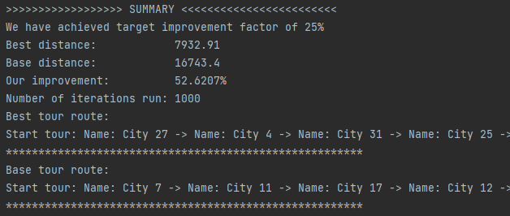

### How to start

To run the app, clone the repository and reload CMake Project to generate cmake-build-debug folder.

All options related to the formula and condition of the algorithm can be changed in "Population.hpp"

### About the problem

Classic Travelling Salesman problem. Given a list of cities and their coordinates, what is the shortest possible route that visits each city and returns to the original city
The Travelling Salesman Problem is one of the most intensely studied problems in the field of optimization. While there are exact algorithms for finding the shortest route (including brute-force search, of course), calculating the solution can take years! We will explore a heuristic that finds a good solution, possibly a very good solution, in a reasonable amount of time: a genetic algorithm

A genetic algorithm is an algorithm that draws inspiration from theories of natural selection. That is, we start with a ‘population’ of sample candidates, evaluate their fitness, perform some sort of cross-over and mutation, and continue until we have a solution that most closely meets our needs or meets our termination criteria.

### Terms

**City**: A location that has a name and x/y coordinates.

**Cities_to_visit**: an invariant (unchanging) list of City structs that
we want to visit. The “master list.”

**Tour**: a list of pointers to the cities we want to visit. We can shuffle
the pointers easily to compare different orderings of cities
without modifying the ”master list”.

**Population**: a collection of candidate Tours. We keep the
population “sorted,” i.e., the “fittest” tours are at the front of the
list.

**Fitness**: Each candidate Tour in the population has a fitness,
i.e., how “good” it is. For us, a fit Tour has a short travel
distance. A Tour with a shorter distance has better fitness.

**Elite**: Each generation, we can designate one or more Tours
that are so amazing they don’t cross, they get carried over to
the next ‘generation’. These Tours are “elite.”

**Crosses and Crossover**: Each generation we create new Tours
by crossing “parents.” The crossover algorithm is basic.

**Parents**: Each iteration, we select some parents from the
Population of Tours and use the parents’ contents to generate a
new Tour for the next iteration.

**Mutation**: Each iteration, we randomly “mix up” a few of the
Tours in our population. This mimics the random mutations that
take place as cells divide, etc.

**Mutation** rate: If we ‘roll’ less than the rate, we swap a few
cities in the Tour being mutated.

### The Algorithm

1 Create our master list of cities (CITIES_IN_TOUR) named 1, 2, 3, ....

2 Create a Population of Tours. The Population contains 
candidate Tours. Each Tour contains pointers that point to
the cities in the master list. Each Tour is shuffled randomly

### Default values for the conditions:

| Value | Data Type | Default Value | Description
|-----------|:-----------:|:-----------:| -----------:|    
| PARENT_POOL_SIZE | Integer | 5 | Number of candidates to be selected as parent for mutation |
| MUTATION_RATE | Integer | 30 | Mutation rate |
| CITIES_IN_TOUR | Integer | 32 | the number of cities we are using in each simulation |
| POPULATION_SIZE | Integer | 32 | the number of candidate tours in our population |
| MAP_BOUNDARY | Integer | 1000 | Random integer generator, size of map |
| improvement_factor | Double | 0.75 | Improvement factor, indicate desired improvement, 0.75 indicates an expectation of 25% improvement our total Tour distance |
| ITERATIONS | Integer | 1000 | Number of iterations to run genetic algorithm |
| PERCENTAGE | Double | 0.30 | Percentage to take from population to mutate |
| SCALAR_VALUE | Unsigned Integer | 100000 | Scalar value |

### Example of the result:

